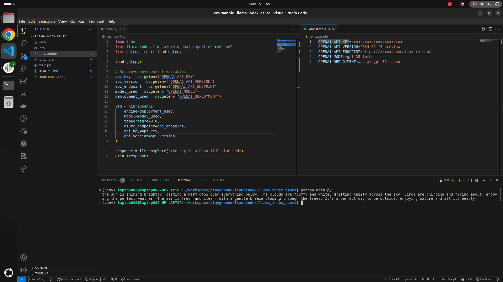

# LlamaIndex Azure OpenAI - Proof of Concept

## Introduction

This repository provides a Proof of Concept (POC) for integrating LlamaIndex with Azure OpenAI services. 

## Prerequisites

- Python 3.12.3

## Setup Instructions

1. **Check Python Version**

    Ensure you have Python 3.12.3 installed:

    ```bash
    python --version
    ```

2. **Create a Virtual Environment**

    Create a virtual environment to manage dependencies:

    ```bash
    virtualenv venv
    ```

3. **Activate the Virtual Environment**

    Activate the virtual environment:

    ```bash
    source venv/bin/activate
    ```

4. **Install Required Packages**

    Install the required packages from `requirements.txt`:

    ```bash
    pip install -r requirements.txt
    ```

5. **Run the Application**

    Run the main application script:

    ```bash
    uvicorn app.main:app --reload
    ```

6. **Freeze Dependencies**

    Freeze the current state of dependencies to `requirements.txt`:

    ```bash
    pip freeze > requirements.txt
    ```

7. **uvicorn app.main:app**
    
    ```bash
    uvicorn app.main:app 
    ```

8. **Streamlit frontend**
    
    ```bash
    streamlit run frontend/app.py 
    ```

## Screenshot

Here is a screenshot of the application in action:



## Reference

For more information on how to use LlamaIndex with Azure OpenAI, please refer to the [LlamaIndex documentation](https://docs.llamaindex.ai/en/stable/examples/llm/azure_openai/).

## Additional Information

- Make sure to customize `main.py` as per your POC requirements.
- Update `requirements.txt` as necessary when adding or updating dependencies.
